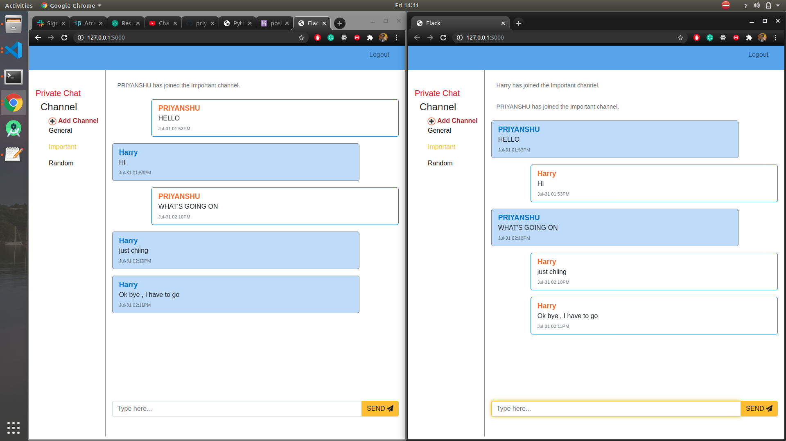
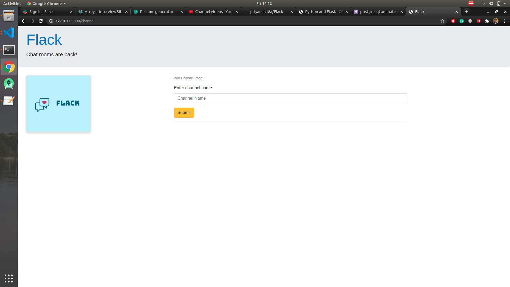
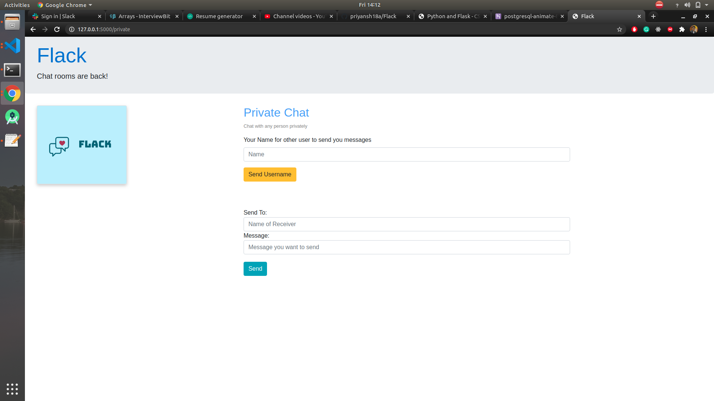

# Flack 

### A project of Harvard University Course

This project is part of web programming with python and javascript course by Harvard University. This program is similar to a mini version of slack with the functionality of communicating with users all other users present in the corresponding channel. Users can also add channels of whatever name they want. Also, two users can have a private chat on this project.

**This project is made using Flask. It uses Flask Web-Socket for real-time communication. For other things, it uses Bootstrap-4, Javascript in addition to HTML and CSS.**

[Project Working Video](https://youtu.be/R80PLtOreJM)

### Portal Screenshots:

Chat Between Two People :

Add Channel Page:

Private Chat Page:

